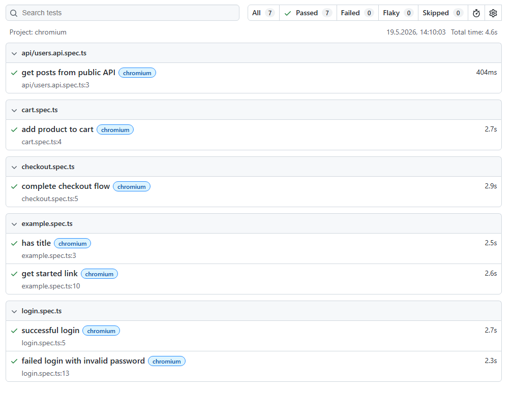

# Playwright Demo Framework


Modern Playwright automation framework showcasing scalable QA automation practices, maintainable test architecture and CI/CD integration.

---

## Features

- End-to-End UI Testing
- API Testing
- Page Object Model
- Reusable Fixtures
- Test Data Management
- HTML Reporting
- GitHub Actions CI
- Cross-browser support

---

## Tech Stack

- Playwright
- TypeScript
- GitHub Actions
- CI/CD
- Page Object Model
- REST API Testing

---

## Project Structure

```text
playwright-demo-framework
│
├── data/
├── fixtures/
├── pages/
├── tests/
│   └── api/
├── utils/
├── docs/
├── playwright.config.ts
└── README.md
```

---

## Included Test Scenarios

### UI Tests

- Successful Login
- Invalid Login
- Add Product to Cart
- Complete Checkout Flow

### API Tests

- Public REST API validation
- Response verification
- JSON validation

---

## Run Tests

```bash
npx playwright test
```

---

## Open HTML Report

```bash
npx playwright show-report
```

---

## Example Report



---

## CI/CD

This project includes a GitHub Actions workflow for automated Playwright test execution.

---

## Demo Application

https://www.saucedemo.com

---

## Author

Jens Haupt  
Senior QA & Test Automation Consultant

🌐 https://www.haupt-testing.de